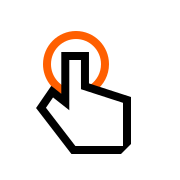

# Debouncable

[](https://jitpack.io/#RudolfHladik/debouncable)

Debouncable is action interface used to debounce user input actions.
`debouncing` is good to prevent multiple clicks at the same time, double
 clicks, and misclicks.

## Installation

Library is published via [JitPack](https://jitpack.io/#RudolfHladik/debouncable)
publishing platform. To use it in your project, add a reference to
JitPack maven to project level `build.gradle`:

```groovy
allprojects {
    repositories {
        ...
        maven { url 'https://jitpack.io' }
    }
}
```

Add library as dependency:

```groovy
dependencies {
     implementation 'com.github.RudolfHladik:debouncable:1.0.0'
}
```

## Usage

Debouncable is meant to be used within your `ViewModel` or presenter. Start
with `Debouncable` interface implementation:

```kotlin
class MyViewModel : ViewModel() , Debouncable
```

Since this moment you can use `debounceAction()` method to debounce user's
clicks:
```kotlin
class MyViewModel : ViewModel() , Debouncable {
  
  fun onClickA() {
    debounceAction {
      // this code will be debounced
    }
  }
  
  fun onClickB() = debounceAction { // more idiomatic way
    // this code will be debounced
  }
}
```

#### Debounce limit

Debounce limit is set to `200ms` by default. In case you want to override
this value pass requested limit to `debounceAction()`:
```kotlin
debounceAction(400L) {
    // this code will be debounced
}
```

## Contributors

Current maintainer and main contributor is [Rudolf Hladík](https://github.com/RudolfHladikr).

## License

Debouncable is available under the MIT license. See the [LICENSE](LICENSE) for more information.
